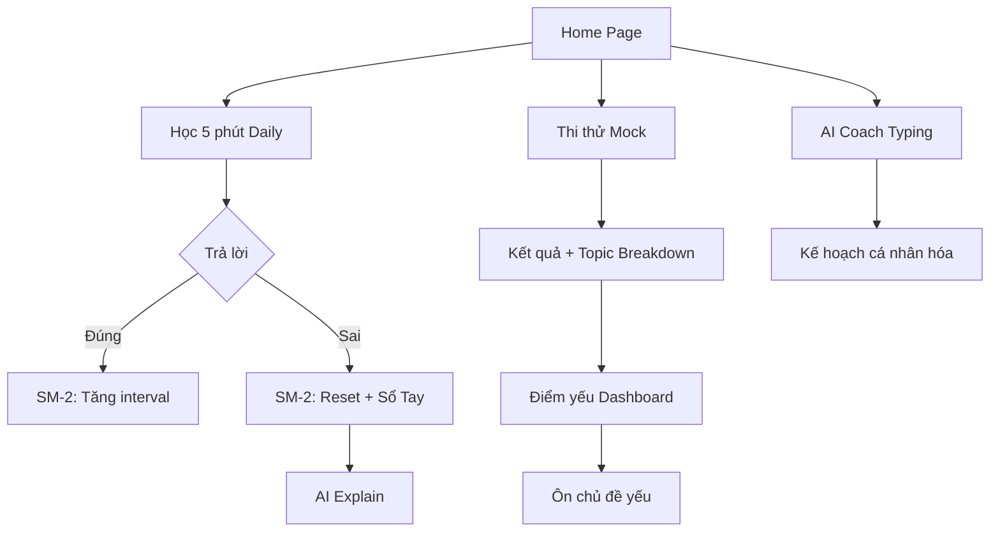

# Hệ thống "Học dễ – Đậu cao – Dùng lâu"

## Tổng quan

Hệ thống học tập thông minh gồm 7 tính năng chính giúp học viên thi đỗ 100%.

## Luồng hoạt động

## Data Model (localStorage)

### ReviewItem (SM-2)
| Field | Type | Description |
|-------|------|-------------|
| questionId | string | ID câu hỏi |
| dueAt | string | ngày đến hạn "2026-02-20" |
| intervalDays | number | interval hiện tại |
| repetitions | number | lần trả lời đúng liên tiếp |
| easeFactor | number | hệ số dễ (bắt đầu 2.5, min 1.3) |
| lapses | number | tổng số lần lapse |

### StreakData
| Field | Type |
|-------|------|
| currentStreak | number |
| longestStreak | number |
| lastActiveDate | string (Asia/Ho_Chi_Minh) |

## API Endpoints

| Route | Method | Mô tả |
|-------|--------|-------|
| `/api/ai/explain` | POST | AI giải thích tại sao sai |
| `/api/ai/diagnostic` | POST | AI phân tích + kế hoạch học |
| `/api/ai/settings` | GET | Xem trạng thái API key (admin) |
| `/api/ai/settings` | PUT | Lưu API key encrypted (admin) |
| `/api/questions` | GET | Lấy câu hỏi (có sẵn) |

## UI Screens

| Route | Mô tả |
|-------|-------|
| `/` | Home: AI Coach, streak, due count, CTAs |
| `/daily` | Phiên học 5 phút (10 câu) |
| `/so-tay-sai` | Sổ Tay Câu Sai + filter + AI explain |
| `/diem-yeu` | Dashboard điểm yếu theo chủ đề |
| `/admin/ai-settings` | Quản lý OpenAI API key |

## Bảo mật

- API key mã hóa AES-256-GCM, lưu `data/ai-config.json` (gitignored)
- Master key: env var `AI_MASTER_KEY`
- Admin PIN: env var `ADMIN_PIN`
- OpenAI call server-side only, key không xuất hiện ở client/network tab

## Giả định & Cấu hình

| Giả định | Giá trị | Vị trí |
|----------|---------|--------|
| Số câu daily | 10 | `dailyStore.ts` DAILY_QUESTION_COUNT |
| SM-2 ease ban đầu | 2.5 | `reviewStore.ts` |
| AI model | gpt-4o-mini | env `AI_MODEL` |
| Timezone | Asia/Ho_Chi_Minh | Hardcoded |
| Admin PIN mặc định | 1234 | env `ADMIN_PIN` |

## Manual QA Checklist

1. ☐ Home → thấy streak (0), due count (0), "Học 5 phút" CTA
2. ☐ Thi thử → trả lời sai → nộp bài
3. ☐ Xem results + topic breakdown
4. ☐ Vào Sổ Tay Câu Sai → thấy câu sai + đáp án
5. ☐ Filter theo chủ đề
6. ☐ Bấm "Vì sao sai?" → AI explain (cần cấu hình key)
7. ☐ Bấm "Ôn lại" → câu được thêm vào review
8. ☐ Daily session → 10 câu → hoàn tất → streak +1
9. ☐ Home → AI Coach typing (cần ≥5 câu + API key)
10. ☐ Admin AI Settings → nhập PIN → nhập key → lưu
11. ☐ Network tab → không thấy API key
12. ☐ `npm run build` pass
